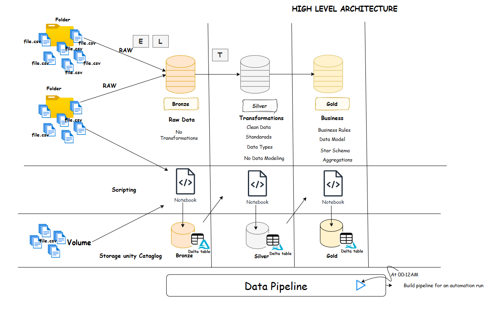

🚀 End-to-End Data Engineering Pipeline – Databricks Lakehouse
📌 Project Overview

Designed and implemented an end-to-end Data Engineering pipeline using the Medallion Architecture (Bronze → Silver → Gold) within a Databricks Lakehouse environment. The project simulates real-world enterprise data workflows including ingestion, transformation, governance, and scheduled orchestration.
## 🏗️ Architecture

This project follows the **Medallion Architecture**:

### 🥉 Bronze Layer
- Raw data ingestion  
- Schema inference and storage as Delta tables  

### 🥈 Silver Layer
- Data cleaning and standardization  
- Type casting and validation  

### 🥇 Gold Layer
- Dimensional Data Model (Business Transformation)
- Ready for BI and analysis  

---

⚙️ Key Implementations

Built an end-to-end data pipeline using PySpark and Spark SQL

Implemented Delta Lake for:

ACID compliance

Schema enforcement & schema evolution

Time-travel capabilities

Developed job pipelines in Databricks Workflows

Scheduled the pipeline to run on a daily basis for automated data processing

Ensured data quality and handled duplicate records using MERGE operations

Managed data governance using Unity Catalog

## 🛠️ Technologies Used

- Databricks  
- Apache Spark  
- PySpark  
- Spark SQL  
- Delta Lake  
- Unity Catalog  

